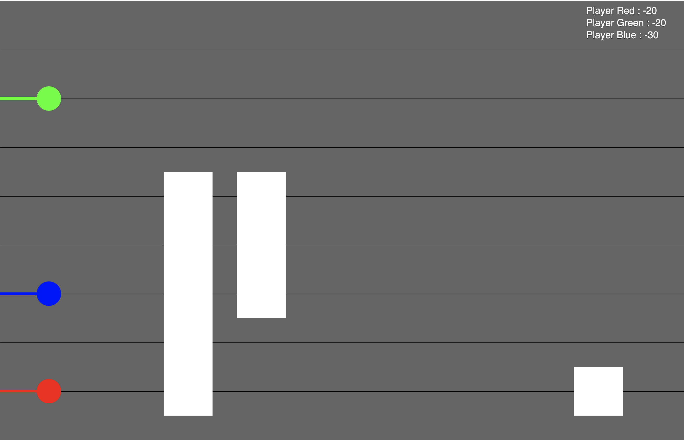
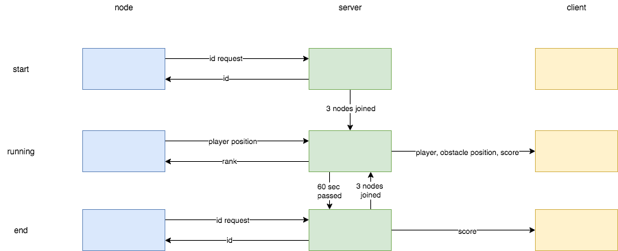

# Sever

This is the server (javascript) in the coursework. 

## Usage
Node.js is required to be installed for running the script. 
Dependencies of this script also includes `express`   
`npm install express`  

A webpage would be hosted in port 3000, after starting `node.js` by  
`node index.js`  

go to the link `http://localhost:3000/`, and the following webpage should be seen.
  

The three ellipses represent three players in the game, with the white rectanges being the obstacles. Collision detection is applied, and each player scores would be -10 when it hits an obstacle. Lines on the screen represents the levels that the players can get to, and should have a total of 8 lines.

## Parametrs
Currently variable number of players is not supported, it is required to have 3 players in the game. A maximum of 3 obstacles would appear on the screen.  
Obstacles move at a speed of 500 pixels per 1s, position of obstacle is refreshed every 10ms.  
Game is in time-limited mode, rank is determined by the player who hit the least obstacles in 60 seconds.  

## Files
1. `index.js` is the main server file, which utilised `node.js` 
2. `node_obstacle.js` contains class ObstaclesNode which contain attributes and methods that calculates position of obstacles and detect collisions. 
3. `public/index.html` includes all the javascripts needed in the client-side
4. `public/sketch.js` has the main code on client-side javascripts that contributes to most of the functionality
5. `public/player.js` and `public/obstacles.js` contains class Player and Obstacles respectively
6. `UDPC.py` is the simulated node that would be sending out UDP packets received from FPGA via UART

## Server
`index.js` runs `node.js` which serves as a back-end server. It establish a port at `localhost::3000` which will be displaying files in `/public` with `index.html` as the "main" html file. 

The server starts with a `start` status, which is waiting for nodes to connect. It assigns unique player id per request from UDP packets (sent from `UDPC.py`). When the number of nodes connecting to the server meets the static number of players. It starts the game and move to `running` status.

In `running` status, it implements a timer and ends the game after 60 seconds. It returns a packet containing position of players and obstacles and scoreboard whenever client requests data from the server as a "response". It also actively receives UDP packets from nodes to update position of the players and return the current rank of the players.

After 60 seconds, the server goes to the `end` status, which players and obstacles position no longer being updated. Unique player id is resetted and is ready to start a new game. It will get back to the `running` status once sufficient number of nodes have reconnected to it.

## Node
`UDPC.py` represents node in the actual system, which actively sends two-byte UDP packets to the server.

It first tries to connect the server by requesting a player id. Id-request packets should have the second byte = `7`. The server then returns a one-byte UDP packet indicating the id. Id-request packet should only be sent once.

It then sends packet which contains the level of FPGA, in the format `[lvl,id]`

## Client
`public/sketch.js` contains the main JavaScript code that contributes the styling and interface of this sytem. It constantly asks for data from the server and update the position of players and obstacles.

## Data Flow
A brief overview of the data flow and state diagram of the nodes, server and clients as below:
  

## Future Development
1. more aesthetic leaderboard and countdown
2. allow dynamic number of players

## Change Log
14-Mar-2021 : initial transfer  
16-Mar-2021 : added scoreboard + player trail + some kind of page linking  
17-Mar-2021 : added dynamic leaderboard by rank  
19-Mar-2021 : added confirmation to Python script when connecting + sends Python script current rank of player + timer in game  
23-Mar-2021 : added power ups + timer + players shown in "start" and "end" page  